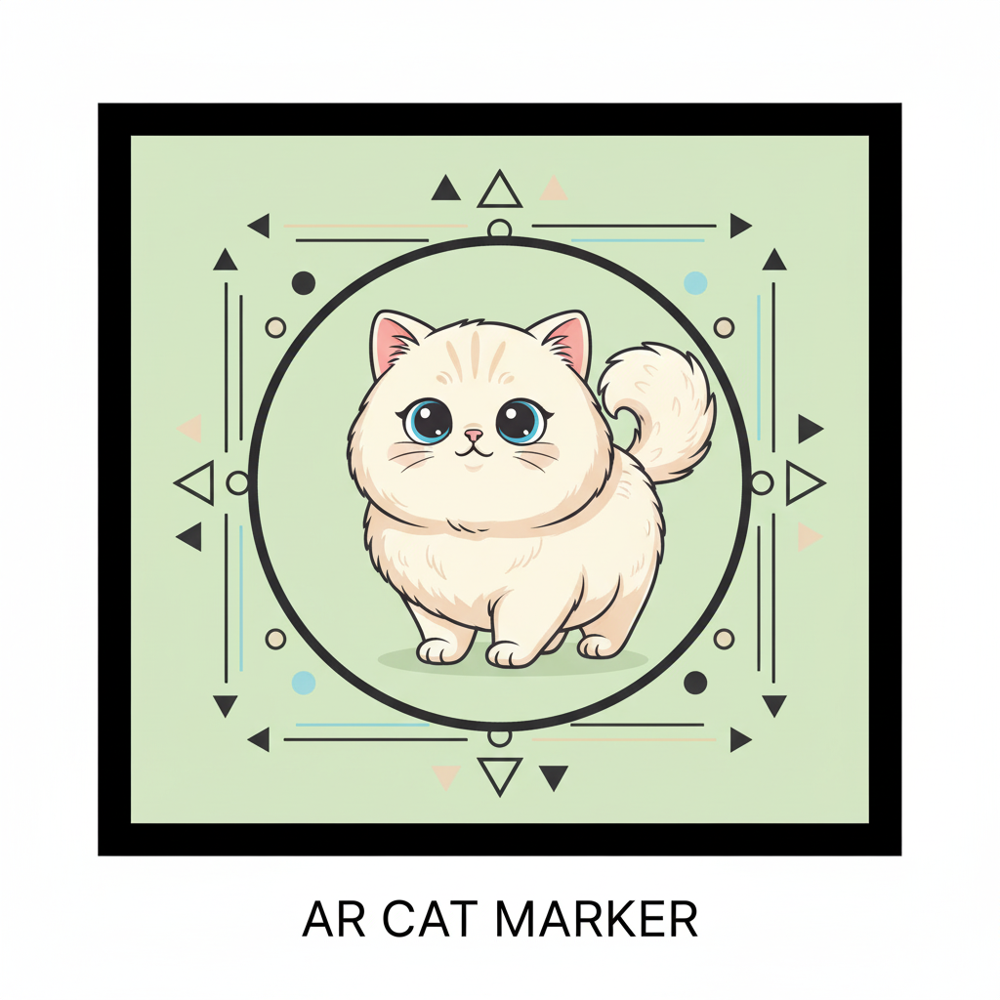

# AR Marker Project

## Deskripsi

Proyek ini merupakan aplikasi **Augmented Reality (AR) marker-based** yang memungkinkan pengguna memindai marker tertentu untuk menampilkan model 3D interaktif di layar. Aplikasi ini dikembangkan menggunakan **Unity** dan **Vuforia**.

## Fitur

- Pemindaian marker AR menggunakan **Vuforia Engine**
- Menampilkan model 3D dari **Sketchfab**
- Interaksi dasar dengan objek 3D (rotasi, zoom)
- Tampilan yang responsif dan mudah digunakan

## Teknologi

- **Unity** (versi 6000.0.59f2)
- **Vuforia Engine** (versi 11.4.4)
- Model 3D dari **Sketchfab**

## Cara Menjalankan

1. Buka proyek di **Unity**.
2. Pastikan **Vuforia Engine** sudah diaktifkan di `XR Settings`.
3. Pastikan marker yang digunakan sesuai dengan yang disediakan.
4. Build ke platform yang diinginkan (Android/iOS/PC).
5. Scan marker untuk melihat model 3D.

## Credit / Lisensi

- Model 3D diambil dari **Sketchfab**: [Link Model](https://sketchfab.com/3d-models/cat-70a23788ef984a7a9a1c9a9fe6d5a651)
- Design oleh: **Suushimi✨ / https://sketchfab.com/Suushimi**
- Lisensi: **CC Attribution-NonCommercial (CC BY-NC)**

## Demo

---
